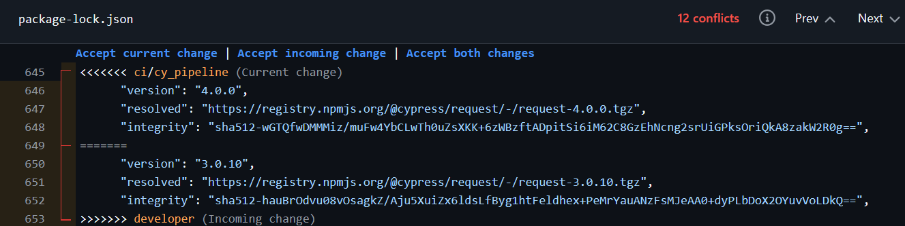

# Refaktoring

Refaktorering handler om at forbedre kodens struktur uden at ændre dens adfærd. I dette projekt er der arbejdet ud fra følgende principper:

- **DRY** (Don't Repeat Yourself) – undgå duplikering af kode
- **SRP** (Single Responsibility Principle) – én funktion/klasse, ét ansvar
- **KISS** (Keep It Simple, Stupid) – hold koden enkel og læsbar
- **YAGNI** (You Aren't Gonna Need It) – byg kun det der faktisk er brug for
- **Selvdokumenterende kode** – klare navne og eksplicitte typer gør koden lettere at forstå. TypeScript hjælper med dette ved at tvinge eksplicitte typer og interfaces.

## Eksempel

### Hvad blev refaktoreret

Søgelogikken i `manager/HomeView.vue` blev trukket ud i en selvstændig composable `useSearch.ts`.

**Før** – søgelogikken lå hardcodet direkte i komponenten:
```ts
const searchQuery = ref('');
const searchResults = computed(() => {
    if (!searchQuery.value) return userStore.clientList;
    const query = searchQuery.value.toLowerCase();

    return userStore.clientList.filter(client =>
        client.firstName?.toLowerCase().includes(query) ||
        client.lastName?.toLowerCase().includes(query) ||
        client.phoneNumber?.toLowerCase().includes(query),
    );
});
```

**Efter** – søgelogikken er trukket ud i `useSearch.ts`, og komponenten kalder blot composable'en:
```ts
// ManagerHomeView.vue
const { searchResults, onSearchFetch } = useSearch(
    () => userStore.clientList,
    (client, query) =>
        client.firstName?.toLowerCase().includes(query) ||
        client.lastName?.toLowerCase().includes(query) ||
        client.phoneNumber?.toLowerCase().includes(query) ||
        client.caseId?.some(ref => ref?.path?.split('/')[1]?.toLowerCase().includes(query)),
);
```

```ts
// useSearch.ts
export function useSearch<T>(
    items: () => T[],
    filterFn: (item: T, query: string) => boolean,
) {
    const searchQuery = ref('');

    const searchResults = computed(() => {
        if (!searchQuery.value) return items();
        const query = searchQuery.value.toLowerCase();

        return items().filter(item => filterFn(item, query));
    });

    return { 
        searchQuery, 
        searchResults, 
        onSearchFetch 
    };
}
```

### Hvorfor blev det refaktoreret

Søgelogikken var tæt koblet til `manager/HomeView` og kunne ikke genbruges andre steder. Ved at trække den ud i en composable opnås:

- **DRY** – søgelogikken skal ikke skrives igen i andre komponenter der har brug for søgning
- **SRP** – komponenten håndterer visning, composable håndterer søgelogik
- **KISS** – komponenten bliver kortere og lettere at læse

## Pull Requests og Code Review

Det anbefales at læse [Versionsstyring](versionsstyring.md) før dette afsnit.

Når en feature-branch er klar til at blive merget ind i `developer`, oprettes der en pull request af den ansvarlige udvikler. De øvrige gruppemedlemmer gennemgår koden som reviewers inden den merges.

Dette sikrer at:
- Fejl opdages inden de når `developer`
- Alle i gruppen har kendskab til ændringerne
- Koden lever op til projektets standarder

### Merge konflikter

Merge konflikter opstår når to branches har ændret den samme del af en fil.
VS Code markerer konflikterne direkte i editoren og viser antallet øverst til højre.



Den øverste blok (markeret med `<<<<<<< ci/cy_pipeline`) viser koden fra den aktuelle branch, og den nederste blok (markeret med `>>>>>>> developer`) viser de indkommende ændringer. Skillelinjen `=======` adskiller de to versioner.
Konflikten løses ved at klikke **Accept current change**, **Accept incoming change** eller **Accept both changes** øverst i konfliktzonen, og derefter committe resultatet.