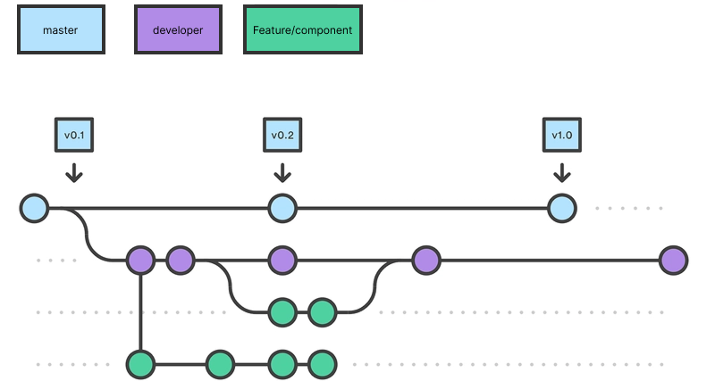

# Versionsstyring

## Git
Til versionsstyring af dette projekt er der brugt Git, som er et distribueret VCS. Det giver god mulighed for samarbejde mellem udviklere. Git fungerer via tre faser: Working directory → Staging area → Repository.  

**Working directory:** Din lokale mappe med filer. Når du redigerer filen, ved Git noget har ændret sig, men gør intet ved det.  
**Staging area:** Når du bruger git add eller via din IDEs GUI flyttes ændringerne i filen til en "forberedelsesboks".  
**Repository:** Når du kører git commit eller igen via din IDEs GUI gemmes det du har tilføjet i din "forberedelsesboks" som et snapshot i Git's historik sammen med et unikt commit ID.

Mest brugte git kommandoer:

| Kommando | Beskrivelse |
|----------|-------------|
| `git add` | Tilføjer ændringer til staging area klar til commit |
| `git commit -m "Your commit message"` | Gemmer de staged ændringer med en besked der beskriver hvad der er lavet |
| `git push` | Sender dine lokale commits op til remote repository på GitHub |
| `git pull` | Henter og integrerer seneste ændringer fra remote repository |
| `git checkout your-branch-name` | Skifter til en eksisterende branch. Tilføj `-b` før branch-navnet for at oprette og skifte til en ny branch |
| `git merge merging-branch-name` | Merger en branch ind i den aktive branch. Husk at skifte til den branch du vil merge ind i først |

## Remote Repository
Til projektet er der brugt GitHub som remote repository, hvor projektet ligger frit tilgængeligt https://github.com/JonatanEmil/pentia-dashboard-app.
Github udbyder gode muligheder for forberedt samarbejde, som issues der har tilknyttede ID'er, og projekts, der kan forbindes med issues.

## Branching-strategi
Projektet har tilstræbt Feature Branching som branching-strategi. 
Det betyder at der oprettes en ny branch for hver feature eller Vue-komponent der udvikles. 
Når en feature er færdig, merges den tilbage til `developer` branchen via et pull request eller git merge. `developer` bruges som integrationsgren 
og merges ind i `master` når koden er stabil for en produktionsversion.  
master ← developer ← feature/komponent-navn

### Model

*Modificeret fra [Git Branching Strategies: A Comprehensive Guide](https://dev.to/karmpatel/git-branching-strategies-a-comprehensive-guide-24kh)*

## Commit Messages
I projektet er der tilstræbt gode commit messages. Det vigtigste er at de skrives i nutid, er korte og er specifikke omkring hvad de ændrer.

### Eksempler
**God commitbesked:** "Add correct path name for image seeder and correct props for itemlist in clientview #32"  
**Middelmådig commitbesked:** "style for CarouselHandler.vue #98"  
**Dårlig commitbesked:** "..."